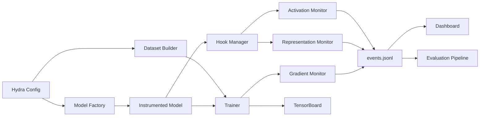

# Technical Report

## Abstract

This report describes the Deep Training Dynamics Framework, a modular system for supervised vision training augmented with internal diagnostic instrumentation. The framework captures activations, gradients, attention-like tensors, and representation trajectories during training, then aggregates those signals into structured artifacts suitable for analysis, monitoring, and downstream early-warning evaluation. The project is designed for controlled experiments where training stability, signal quality, reproducibility, and diagnostic interpretability matter as much as raw accuracy.

## Introduction

Modern deep learning workflows often expose only external metrics such as training loss and validation accuracy. Those metrics are useful but late. By the time a visible collapse appears in validation performance, the internal training state may already have drifted into a poor regime. This repository addresses that gap by logging internal model dynamics in parallel with supervised optimization.

The system targets three questions:

1. What internal signals are available during training without invasive model rewrites?
2. Which of those signals correlate with later generalization degradation?
3. How can those signals be surfaced in a practical monitoring workflow?

## Literature Review

The framework is informed by several adjacent areas of research and practice:

- Training dynamics analysis: gradient norms, curvature proxies, and sharpness-inspired diagnostics are commonly used to detect unstable optimization.
- Representation analysis: CKA and SVCCA-style methods are established tools for comparing internal features across runs or epochs.
- Activation monitoring: sparsity, entropy, covariance spectrum, and dead-neuron ratios are practical summaries of layer behavior.
- Causal time-series analysis: Granger-style feature ranking provides a lightweight first-pass method for studying temporal predictive relations between internal signals and later validation deterioration.
- Overfitting prediction: meta-models built from historical run traces aim to predict failure before performance visibly collapses.

This implementation does not claim state-of-the-art causal identification. It provides a practical instrumentation substrate on which stronger experimental designs can be built.

## Methodology

### Training workflow

Training is driven by Hydra configuration and the [main.py](C:/Users/lenovo/Desktop/JupyterProject/main.py) entrypoint. A composed configuration selects:

- dataset specification
- model specification
- optimizer specification
- diagnostic monitors
- output location
- tracking backends

The training loop logs step-level losses, validation metrics, and monitor outputs to `events.jsonl` and TensorBoard.

### Internal signal capture

The hook layer attaches forward hooks to selected modules and optionally records:

- module inputs
- forward activations
- output gradients
- attention tensors or attention-like outputs

The capture policy is controlled by `HookSpec`, including module glob patterns, storage location, detachment behavior, CPU transfer, and bounded history per module.

### Diagnostic monitoring

Three principal monitor families are implemented:

- Activation monitor
  Computes moments, entropy, sparsity, dead-neuron ratio, covariance trace, singular spectrum summaries, drift, and instability.
- Gradient monitor
  Computes gradient norm, variance, cosine similarity to previous gradients, sharpness proxy, Hessian trace proxy, and exploding-gradient flag.
- Representation monitor
  Computes epoch-to-epoch representation shift using CKA, SVCCA approximation, and mean cosine drift.

An early-warning component writes placeholder epoch-level recommendations to the log. It is intentionally conservative and is best viewed as a scaffolding point for richer policies.

## Architecture

### System components



### Data flow summary

1. A dataset is constructed with deterministic preprocessing and optional caching.
2. A model is built and wrapped by `InstrumentedModel`.
3. The trainer executes supervised optimization.
4. Hooks expose tensors to diagnostics.
5. Diagnostics write summaries to JSONL and TensorBoard.
6. Post-run evaluation builds temporal features from the log.

Pipeline diagram:


## Causal Analysis Methods

The repository currently uses a lightweight temporal evaluation pipeline rather than a full structural causal model.

### Meta-sequence construction

`MetaSequenceDataset` aggregates epoch-level diagnostic summaries and constructs fixed windows with future prediction horizons. Targets include:

- `y_overfit`: whether validation accuracy drops by at least `collapse_drop` within the next horizon
- `y_collapse_epoch`: relative position of the minimum future validation accuracy

### Signal scoring

The current evaluator combines selected internal signals into a normalized risk score and measures:

- ROC-AUC against the overfitting target
- false positive rate at a fixed threshold
- lead-time proxy
- correlation with validation degradation

### Granger ranking

For each logged feature, the evaluator computes a Granger-style p-value against the validation degradation series and ranks features by minimum p-value across lags.

### Interpretation guidance

These results should be treated as hypothesis-generating rather than definitive causal claims because:

- feature logging is observational
- confounding between optimization state and model capacity remains unresolved
- p-values depend on logging cadence, horizon choice, and window length

## Experiments

### Default experiment family

The repository is structured around image classification experiments with Hydra-managed variants across:

- dataset choice
- model family
- optimizer
- diagnostic frequency
- label noise
- caching and augmentation strategy

### Recommended baseline experiment

```bash
python main.py exp.name=cifar10_resnet18_baseline training.epochs=5
```

### Suggested ablations

1. Disable activation monitoring and compare run overhead.
2. Disable representation monitoring and compare predictive power.
3. Sweep optimizer type across `adamw`, `adam`, and `sgd`.
4. Sweep label noise probability to test robustness of warning signals.
5. Compare CIFAR-10 and CIFAR-100 under identical monitoring settings.

### Experimental artifacts

Each run should produce:

- `events.jsonl`
- TensorBoard summaries
- optional external tracker logs
- evaluation JSON printed by `scripts/evaluate_run.py`

## Results

The repository now includes a validated automated test framework covering training, datasets, hooks, visualization paths, stress scenarios, and reproducibility constraints. The current test suite passes with enforced coverage.

Observed engineering results:

- deterministic pytest workflow with controlled seeding
- import-safe dashboard module
- verified logging paths for activation, gradient, and representation diagnostics
- validated Tiny ImageNet and WILDS wrapper behavior under test doubles
- enforced minimum measured test coverage

The repository does not ship benchmark tables for accuracy or causal-prediction quality across large experimental grids. Those results should be generated per study.

## Limitations

- The dashboard is intentionally lightweight and reads from JSONL logs rather than a dedicated metrics store.
- The early-warning system is still rule-light and does not yet use a trained meta-model in the live loop.
- Granger analysis is only a weak proxy for causal influence.
- Several model-factory branches depend on external packages and pretrained interfaces that are not exercised in large-scale end-to-end training here.
- The current report does not claim empirical superiority over existing monitoring systems.

## Future Work

- Train and deploy a learned early-warning meta-model across many runs.
- Add richer calibration analysis for warning confidence.
- Expand dashboard panels for attention visualization and causal graph displays.
- Add experiment registry support and standardized output schemas.
- Extend evaluation from single-run post hoc analysis to multi-run cohort analysis.
- Add distributed training support and explicit mixed-precision monitoring.

## Conclusion

The Deep Training Dynamics Framework provides a practical substrate for studying internal model behavior during vision training. Its value is not limited to final accuracy; it lies in making intermediate training dynamics observable, queryable, and testable. With structured logs, modular instrumentation, and a validated pytest framework, the project is in a stronger position for controlled experiments, monitoring research, and future causal-analysis extensions.
